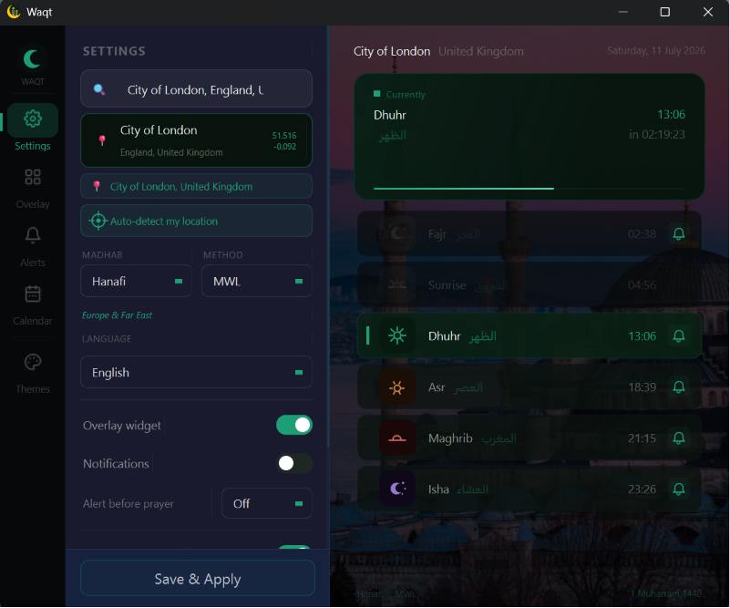

<div align="center">


# 🌙 Waqt

**A prayer times app that lives quietly in your Windows tray — accurate, offline-capable, and yours to reshape.**

[](https://python.org)
[](https://pypi.org/project/PyQt6/)
[](https://windows.com)
[](LICENSE)

[🇬🇧 English](#english) · [🇷🇺 Русский](#русский) · [🇰🇬 Кыргызча](#кыргызча)

</div>

---

## English

### Why Waqt

Most prayer-time apps are either a bare tray icon or a bloated all-in-one Islamic app you don't need. Waqt does one thing: tells you when to pray, accurately, with a UI that doesn't get in the way — and stays out of your way otherwise (no background services beyond the app itself, no accounts, no tracking).

### ✨ Features

- 🕌 **Accurate prayer times** — [Aladhan API](https://aladhan.com), timezone-corrected for DST (resolved via `timezonefinder` → country-code table → REST fallback, so Warsaw is never an hour off in summer)
- 🌍 **Fast auto location** — races 5 IP-geolocation sources in parallel and takes the first answer (~1–2s instead of waiting on all of them), then reverse-geocodes to street/village level, not just "your capital city"
- 📵 **Offline fallback** — caches yesterday's times so the app still shows something useful with no connection
- 🖥️ **System tray** — prayer name + live countdown right in the icon, click for a popup with the full day
- 🪟 **Floating overlay** — draggable, always-on-top, three styles (pill / card / minimal)
- 🔔 **Notifications** — global on/off, a configurable "N minutes before" heads-up, and per-prayer toggles (mute just Sunrise, for example)
- 🔊 **Azan sound** — silent / traditional azan / voice reminder / your own audio file, with volume control
- 📅 **Calendar view** — month grid with Hijri dates alongside Gregorian
- 🎨 **8 color themes** + a **shape style toggle** — flip between a minimal/thin-line look and a bolder, rounder "playful" look independently of color
- 🖼️ **Optional background image** on the main view
- 🌐 **3 languages** — English, Russian, Kyrgyz
- 🕌 **4 madhabs** — Hanafi, Shafi, Maliki, Hanbali · 8 calculation methods (MWL, ISNA, Egypt, Karachi, Makkah, Tehran, Diyanet, Morocco)
- ⚙️ **Autostart** with Windows, single-instance lock (no duplicate tray icons)

### 📸 Screenshots

<table>
<tr>
<td align="center">
<b>Main Window</b><br/>

</td>
<td align="center">
<b>Overlay Widget</b><br/>

</td>
</tr>
<tr>
<td align="center" colspan="2">
<b>System Tray & Notification</b><br/>

</td>
</tr>
</table>

### 🚀 Quick start

**Download the .exe**
```
1. Grab Waqt.exe from Releases
2. Run it — appears in the system tray
3. Click the W icon to open settings
```

**Run from source**
```bash
git clone https://github.com/<you>/Waqt.git
cd Waqt
pip install -r requirements.txt
python main.py
```

`PyQt6-Qt6Multimedia` is optional — only needed if you want the azan sound player; the app runs fine without it (falls back silently).

### 🔨 Build the .exe yourself

```bash
pip install pyinstaller Pillow
python build.py            # → dist/Waqt.exe
python build.py --debug    # keep the console window, for troubleshooting
python build.py --clean    # wipe build/ and dist/ first
```

### 📁 Project structure

```
Waqt/
├── main.py                    # Entry point: splash screen, single-instance lock
├── build.py                   # PyInstaller build script → dist/Waqt.exe
│
├── core/                      # No Qt imports — pure logic, testable in isolation
│   ├── prayer_times.py        # Aladhan API + 4-level timezone resolution
│   ├── location.py            # Parallel IP geolocation with local cache
│   └── settings.py            # JSON settings store (%APPDATA%/Waqt on Windows)
│
├── ui/
│   ├── main_window.py         # Composes panels, owns the countdown timer
│   ├── app_theme.py           # Colors (THEMES) + shape profiles (STYLE_PROFILES)
│   ├── widgets.py             # Reusable pieces: HeroCard, PrayerRow, ToggleSwitch…
│   ├── workers.py             # Background QThreads (fetch, location monitor)
│   ├── onboarding.py          # First-run 5-step wizard
│   ├── overlay.py             # Floating always-on-top widget
│   ├── tray.py                # Tray icon + popup
│   ├── notification.py        # Prayer-time popup toast
│   ├── themes.py              # Theme picker dialog/data
│   └── panels/                # One file per settings screen
│       ├── prayer_panel.py    # Main view: hero card + prayer list
│       ├── settings_panel.py  # City, madhab, method, language, autostart…
│       ├── alerts_panel.py    # Notifications + azan sound
│       ├── overlay_panel.py   # Overlay style picker
│       ├── calendar_panel.py  # Month grid with Hijri dates
│       └── themes_panel.py    # Color themes + shape style toggle
│
└── assets/
    ├── icons/                 # App + UI icons (SVG)
    ├── sounds/                # Azan / voice reminder audio
    └── background_images/     # Optional main-view backgrounds
```

### ⚙️ Settings reference

| Setting | Options |
|---|---|
| City / Country | Any city — search or auto-detect via IP |
| Madhab | Hanafi, Shafi, Maliki, Hanbali |
| Calculation method | MWL, ISNA, Egypt, Karachi, Makkah, Tehran, Diyanet, Morocco |
| Language | EN / RU / KG |
| Overlay style | Pill / Card / Minimal |
| Color theme | 8 themes |
| Shape style | Minimal / Playful |
| Notifications | Global toggle, per-prayer toggle, N-minutes-before |
| Azan sound | Off / Azan / Voice / Custom file, volume |
| Autostart | On / Off (Windows registry) |

### 🛠️ Tech stack

`Python 3.10+` · `PyQt6` · `Aladhan API` · `OpenStreetMap Nominatim` · `Pillow` · `PyInstaller`

### 🤝 Contributing

Issues and PRs welcome. If you're adding a UI panel, follow the existing pattern in `ui/panels/` — a panel owns its own layout, reads/writes the shared `settings` dict, and emits signals rather than reaching into `MainWindow` directly.

---

## Русский

### Зачем Waqt

Большинство приложений с временем намаза — это либо голая иконка в трее, либо перегруженный комбайн со всем исламским контентом сразу. Waqt делает одну вещь: точно говорит, когда молиться, не мешает интерфейсом и не тянет фоновых служб, аккаунтов и трекинга.

### ✨ Возможности

- 🕌 **Точное время намаза** — [Aladhan API](https://aladhan.com), корректный учёт летнего времени (timezonefinder → таблица кодов стран → REST-резерв)
- 🌍 **Быстрая автолокация** — 5 источников IP-геолокации опрашиваются параллельно, берётся первый ответ (~1–2 сек), затем reverse-geocode до уровня посёлка, а не просто столицы
- 📵 **Офлайн-режим** — кэш вчерашних времён, приложение работает и без сети
- 🖥️ **Системный трей** — название намаза и обратный отсчёт прямо в иконке
- 🪟 **Плавающий overlay** — перетаскиваемый, поверх всех окон, 3 стиля
- 🔔 **Уведомления** — глобально, за N минут до намаза, и по каждому намазу отдельно
- 🔊 **Азан** — тишина / азан / голосовое напоминание / свой файл, регулировка громкости
- 📅 **Календарь** — месяц с датами по хиджре рядом с григорианскими
- 🎨 **8 цветовых тем** + **переключатель формы** — минималистичный тонкий стиль или крупный "мультяшный", независимо от цвета
- 🌐 **3 языка** · 🕌 **4 мазхаба**, 8 методов расчёта
- ⚙️ **Автозапуск** с Windows, защита от повторного запуска

### 🚀 Быстрый старт

```bash
git clone https://github.com/<you>/Waqt.git
cd Waqt
pip install -r requirements.txt
python main.py
```

Или скачай `Waqt.exe` из Releases — Python не нужен.

### ⚙️ Настройки

| Параметр | Варианты |
|---|---|
| Город / Страна | Любой город — поиск или автоопределение |
| Мазхаб | Ханафи, Шафии, Малики, Ханбали |
| Метод расчёта | MWL, ISNA, Egypt, Karachi и другие (всего 8) |
| Язык | EN / RU / KG |
| Стиль overlay | Pill / Card / Minimal |
| Цветовая тема | 8 тем |
| Стиль формы | Минимал / Мультяшный |
| Уведомления | Глобально, за N минут, по каждому намазу |
| Азан | Выкл / Азан / Голос / свой файл |
| Автозапуск | Вкл / Выкл |

---

## Кыргызча

### ✨ Мүмкүнчүлүктөр

- 🕌 **Так намаз убактылары** — [Aladhan API](https://aladhan.com), жайдын убактысын эске алуу менен
- 🌍 **Тез жайгашууну аныктоо** — 5 булак параллелдүү сурулат, эң тез жообу алынат
- 📵 **Офлайн режим** — кечээги убакыттар кэштелет
- 🖥️ **Системалык трей** — намаздын аты жана калган убакыт
- 🪟 **Калкыма виджет** — 3 стиль, бардык терезелердин үстүндө
- 🔔 **Эскертмелер** — жалпы, N мүнөт мурун, ар бир намаз үчүн өзүнчө
- 🔊 **Азан** — өчүк / азан / үн менен эскертүү / өз файлыңыз
- 📅 **Календарь** — айлык көрүнүш, хижри күндөрү менен
- 🎨 **8 түс темасы** + **форма стили** (минимал / оюнчук)
- 🌐 **3 тил** · 🕌 **4 мазхаб**

### 🚀 Тез баштоо

```bash
git clone https://github.com/<you>/Waqt.git
cd Waqt
pip install -r requirements.txt
python main.py
```

Же `Waqt.exe` файлын Releases бөлүмүнөн жүктөңүз.

---

<div align="center">

<<<<<<< HEAD
Made with ❤️ for the Muslim community in World
=======
### 🛠️ Tech Stack

`Python 3.10+` · `PyQt6` · `Aladhan API` · `OpenStreetMap Nominatim` · `Pillow` · `PyInstaller`

---

Made with ❤️ for the Muslim community in the World
>>>>>>> aa403e1dfb1bf50636d8189df51514eefa5abd73

*Пайдалуу болсо, GitHub'да ⭐ коюңуз!*

</div>
